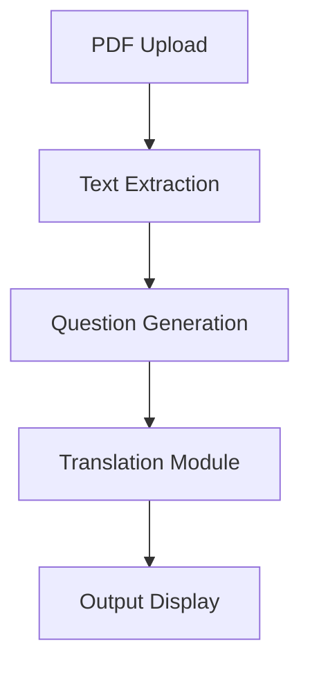

# ASKPDF-AI

## Overview
ASKPDF-AI is an AI-powered multilingual question-answer generator from PDFs, designed to streamline information retrieval. It automatically extracts content from PDFs, generates contextual questions and answers, and supports multiple languages for enhanced accessibility.

## Features
✅ **Text Extraction:** Extracts text from both text-based and scanned PDFs using PyMuPDF and OCR (pytesseract).
✅ **AI-Based Question Generation:** Uses a custom AI-based NLP rule engine to generate questions from extracted text.
✅ **Multilingual Translation:** Supports multiple languages using Google Translate API and MarianMT.
✅ **User Authentication:** Secure login system with hashed passwords using Werkzeug Security.
✅ **Database Storage:** Stores user information and processed text using PostgreSQL / Firebase.
✅ **User-Friendly Web Interface:** Developed with Flask/Django for backend and Streamlit for an interactive UI.

## Technology Stack
- **Programming Language:** Python
- **Backend:** Flask
- **Frontend:** HTML, CSS, JavaScript
- **Database:** SQLite3
- **Libraries & Frameworks:**
  - PDF Processing: PyMuPDF
  - IMAGE PROCESSING: PILLOW, tesseract
  - NLP Models: GPT 3.5 turbo
  - Question Generation: GPT 3.5 turbo
  - Translation: Google Translate API, Translator library
  - OCR: pytesseract
  - Authentication: Werkzeug Security

## Installation & Setup
### Prerequisites
Ensure you have the following installed:
- Python 3.x
- pip (Python package manager)
- Virtual environment (optional but recommended)

### Steps
1. Clone the repository:
   ```sh
   git clone https://github.com/GeekLuffy/ASKPDF-AI.git
   cd ASKPDF-AI
   ```
2. Create and activate a virtual environment (optional but recommended):
   ```sh
   python -m venv venv
   source venv/bin/activate  # For Mac/Linux
   venv\Scripts\activate     # For Windows
   ```
3. Install dependencies:
   ```sh
   pip install -r requirements.txt
   ```
4. Set up the database (if applicable):
   ```sh
   python init_db.py
   ```
5. Run the application:
   ```sh
   flask run  # or `python app.py` based on the framework used
   ```
   The application will be accessible at: http://127.0.0.1:5000/

## How It Works
📂 **Upload a PDF:** The system extracts text from the document. If it's an image-based PDF, OCR (pytesseract) is used.  
❓ **Question Generation:** AI analyzes extracted text and generates structured Q&A.  
🌍 **Translation:** Users can select a preferred language to translate the generated Q&A.  
🔐 **User Authentication:** Secure login and data storage.  

## Workflow


## Future Enhancements
🚀 Improved AI models for better contextual understanding.  
🚀 Voice-based Q&A interaction for accessibility.  
🚀 Integration with academic and research tools.  
🚀 Enhanced UI with React/Vue for a better experience.  
